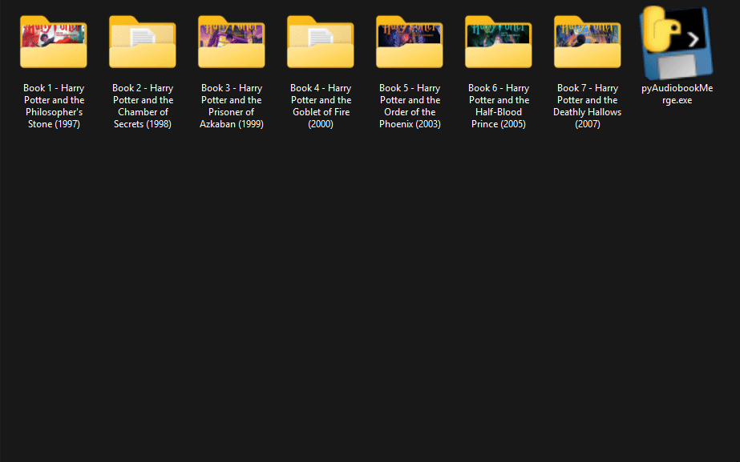

# pyAudiobookMerge
Convert separated chapter MP3s in subfolders into well-structured audiobook files with chapters, metadata, and cover art.

---

## Disclaimers

This tool is still **experimental**. While it might work for some use cases, it may not handle all MP3 collections or metadata perfectly. Sometimes bugs, edge cases, and/or occasional FFmpeg errors may occur.

You are currently limited to the presets provided in the program.

Only works with .mp3s at the moment.

AAC presets are quite slow compared to the other options as the encoder FFMPEG uses is singlethreaded.

Generally reccommend:
- Copy/Remux for speed and to preserve the files original audio quality
- Opus for much lower file sizes with a (generally) minimal change in quality, especially compared to AAC.

## Demo


## Features

- Batch converts multiple folders of MP3 files into a single audiobook per folder.
- Supports multiple presets:
  - **Copy / Remux (Fast, Original Container)**
  - **Opus 32kbps Mono (Speech, Small File)**
  - **AAC 64kbps Mono (Low Bandwidth, Voice)**
  - **AAC 128kbps Stereo (Standard Listening)**
  - **Opus 128kbps Stereo (High Quality, Stereo)**
- Automatically creates chapters from MP3 filenames.
- The program uses the folder name as the audiobook title.
- Extracts metadata from the first MP3 file in a subfolder and applies it to the final audiobook.
- Embeds cover art (jpg/png) provided there is an image file in the subfolder.
- Works as both Python script and standalone EXE (compiled with auto-py-to-exe)

---

## Installation

1. Clone or download this repository.
2. Ensure **Python 3.10+** is installed.
3. Install required packages:

```bash
pip install -r requirements.txt
```
Or use the provided standalone EXE — no Python installation needed.

## Usage

Python version:

```bash
python main.py [root_folder] [-p PRESET]
```
- root_folder (optional): Folder containing MP3 subfolders. Defaults to the current directory if not provided.
- -p PRESET (optional): Preset name from the available presets. If omitted, the script will prompt you to choose.

EXE version:
- Double-click the .exe file.
- Follow the interactive prompts to select folder and preset.
